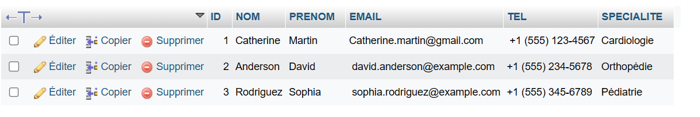

# Spark SQL
Spark SQL is a module within Apache Spark that provides a programming interface for working with structured data using SQL language. It enables developers to write SQL queries to interact with structured data in Spark using DataFrames or Datasets.

Here are some key points to know about Spark SQL:

<ol><li><b>DataFrames and Datasets:</b> Spark SQL primarily uses two data structures: DataFrames and Datasets. A DataFrame is an immutable distributed collection of data in tabular form, and a Dataset is a richer interface that provides strong typing and object-oriented programming features.</li>

<li><b>SQL Support:</b> Spark SQL allows the use of traditional SQL queries to interact with data. You can use SQL expressions to filter, group, aggregate, and manipulate data similar to a traditional relational database system.</li>

<li><b>Integration with External Data Sources:</b> Spark SQL can read data from various sources, including Parquet files, JSON files, relational databases via JDBC, Hive, etc. It offers considerable flexibility for processing data from different sources.</li>

<li><b>Catalyst Optimizations:</b> Spark SQL utilizes the Catalyst optimization engine to optimize queries before execution. This helps improve performance by generating efficient execution plans.</li>

<li><b>Hive Integration:</b> Spark SQL can also be used as a lightweight replacement for Apache Hive. It can execute Hive queries and access Hive metadata without the need for a separate Hive installation.</li></ol>

## Dependencies 

```
<dependencies>
        <!-- https://mvnrepository.com/artifact/org.apache.spark/spark-core -->
        <dependency>
            <groupId>org.apache.spark</groupId>
            <artifactId>spark-core_2.13</artifactId>
            <version>3.4.1</version>
        </dependency>
        <!-- https://mvnrepository.com/artifact/org.apache.spark/spark-sql -->
        <dependency>
            <groupId>org.apache.spark</groupId>
            <artifactId>spark-sql_2.13</artifactId>
            <version>3.4.1</version>
        </dependency>

        <!-- https://mvnrepository.com/artifact/mysql/mysql-connector-java -->
        <dependency>
            <groupId>mysql</groupId>
            <artifactId>mysql-connector-java</artifactId>
            <version>8.0.33</version>
        </dependency>


    </dependencies>

```

## Exercise 1
In this Java Spark SQL program, a Spark session is initialized, named "TP SPARK SQL," and configured to run in local mode across all available cores. Data is loaded from a CSV file ("incidents.csv") into a DataFrame named donnees_incidents, with column renaming. The schema of the loaded data is printed. Two main operations are performed on the DataFrame: first, the count of incidents is displayed per service using groupBy("service").count(), and second, the two years with the highest incident counts are shown. To achieve the latter, a new column "annee" is added to the DataFrame, representing the year extracted from the "date" column. The data is then grouped by year, the incident count is calculated, and the results are ordered in descending order. Finally, the Spark session is stopped. 

### CSV File 

```
  Id,titre,description,service,date
  1,Problème d'accès au réseau,Impossible d'accéder à Internet,Informatique,2023-11-01
  2,Panne de la machine X123,La machine X123 est hors service,Production,2022-11-02
  3,Erreur de facturation,Client facturé incorrectement,Finance,2023-11-03
  4,Problème d'impression,Imprimante ne fonctionne pas,Informatique,2021-11-04
  5,Incident de sécurité,Violation de la politique de sécurité,Sécurité,2023-11-05
  6,Panne de courant,Perte de courant dans le bâtiment,Infrastructure,2021-11-06
  7,Problème de livraison,Retard dans la livraison d'une commande,Logistique,2021-11-07
  8,Erreur de production,Production de produits défectueux,Production,2023-11-08
  9,Problème de ressources humaines,Conflit entre employés,RH,2022-11-09
  10,Problème d'application,L'application plante fréquemment,Informatique,2023-11-10
```

### First Operation 

```
   //Initialize the Spark session
   SparkSession spark=SparkSession.builder().appName("TP SPARK SQL").master("local[*]")
                .getOrCreate();;

  // Load data from CSV file
  String chemin_fichier = "incidents.csv";
  Dataset<Row> donnees_incidents = spark.read().csv(chemin_fichier).toDF("Id", "titre", "description", "service", "date");
  
  // Display the data schema
  donnees_incidents.printSchema();
  
  // Display the number of incidents per service
  Dataset<Row> nombre_incidents_par_service = donnees_incidents.groupBy("service").count();
  nombre_incidents_par_service.show();
```


### Second Operation 

```
 // View both years with the highest number of incidents
 Dataset<Row> donnees_incidents_avec_annee = donnees_incidents.withColumn("annee", functions.year(col("date")));
 Dataset<Row> nombre_incidents_par_annee = donnees_incidents_avec_annee.groupBy("annee").count().orderBy(col("count").desc());
 nombre_incidents_par_annee.show(2);
  
 // Stop Spark Session
 spark.stop();
```


## Exercise 2
The hospital has a web application to manage the consultations of these patients, the data is stored in a MYSQL database named <b>DB_HOPITAL</b>, which contains three tables <b>PATIENTS</b>, <b>MEDECINS</b> and <b>CONSULTATIONS</b>





The Java class employs the Apache Spark framework, specifically the Spark SQL module, to analyze and manipulate datasets associated with patient consultations in a hospital database. It begins by establishing a SparkSession named ss and configuring it to run in local mode. Subsequently, data is loaded from two MySQL database tables, namely "consultations" and "medecins," representing information on patient consultations and medical practitioners, respectively.

### Question 1 
For Question 1, the code inspects the schema of the consultation dataset, converts the "DATE_CONSULTATION" column to the DateType format, and calculates the number of consultations per day. The results are then displayed.

```
  SparkSession ss= SparkSession.builder().appName("les consultations de patients").master("local[*]").getOrCreate();

       
  Dataset<Row> dfConsultations = ss.read().format("jdbc")
           .option("driver", "com.mysql.cj.jdbc.Driver")  // Utilisez la classe de pilote actualisée
           .option("url", "jdbc:mysql://localhost:3306/DB_HOPITAL")
           .option("dbtable", "consultations")  // Utilisez le nom correct de la table (consultation au lieu de PATIENTS)
           .option("user", "root")
           .option("password", "")
           .load();
   
  //Display the schema to check the date column   
  dfConsultations.printSchema();

  // Convertir la colonne de date en format DateType
  Dataset<Row> dfWithDate = dfConsultations.withColumn("DATE_CONSULTATION", col("DATE_CONSULTATION").cast("date"));

  // Use the groupBy and count function to get the number de consultations par jour
  Dataset<Row> consultationsParJour = dfWithDate.groupBy("DATE_CONSULTATION").agg(count("id").as("nombre_consultations"));

  // View Results
  consultationsParJour.show();
```


### Question 2
Moving on to Question 2, the code loads the dataset of medical practitioners and performs a join operation with the consultations dataset based on the "id_medecin" column. The joined dataset is displayed, and subsequently, the code calculates and exhibits the number of consultations per doctor.

```
  // Load Doctors Table 
  Dataset<Row> dfMedecins = ss.read().format("jdbc")
            .option("driver", "com.mysql.jdbc.Driver")
            .option("url", "jdbc:mysql://localhost:3306/DB_HOPITAL")
            .option("dbtable", "medecins")
            .option("user", "root")
            .option("password", "")
            .load();

  // Joined the tables on the id_medecin column
  Dataset<Row> dfJoined = dfConsultations.join(dfMedecins, dfConsultations.col("id_medecin").equalTo(dfMedecins.col("id")).as("id_medecin"));
  dfJoined.show();
  
  // Use groupBy and count to get the number of visits per doctor
  Dataset<Row> consultationsParMedecin = dfJoined.groupBy("NOM", "PRENOM").agg(count("ID_MEDECIN").as("nombre_consultations"));

  // View Results
  consultationsParMedecin.show();
```


### Question 3
Lastly, for Question 3, the code utilizes the joined dataset to determine the number of distinct patients attended by each doctor. The results are displayed once again.

```
  // Use groupBy and countDistinct to get the number of patients per doctor
  Dataset<Row> patientsParMedecin = dfJoined.groupBy("NOM", "PRENOM").agg(countDistinct("id_patient").as("nombre_patients"));

  // View Results
  patientsParMedecin.show();
```


